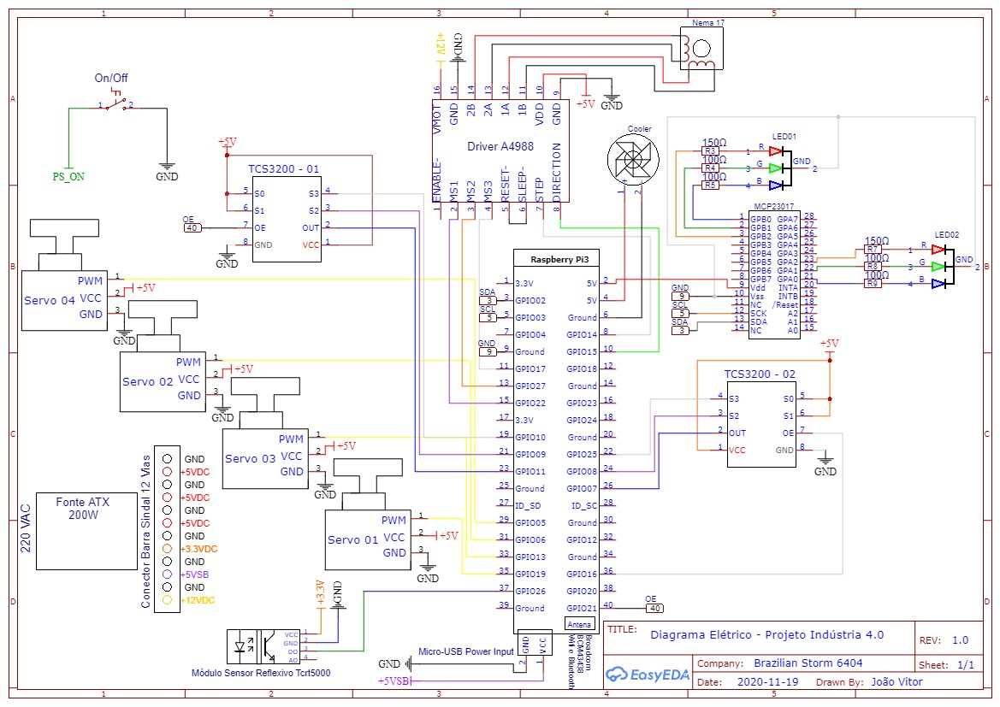
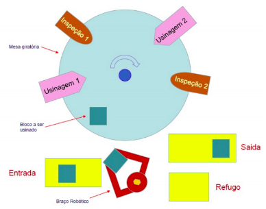

# Maquete indústria 4.0

Controle de uma célula de produção utilizando um braço robótico controlado por servo motores, sensores de cor para identificação de diferentes peças,
simulação de atuadores por meio de LED's, mesa giratória para simulação do processo de produção e uma plataforma web para supervisão.

## Materiais
<ul>
  
RaspBerry PI 3

  
Cartão SD

  
Cooler para RaspBerry PI 3

  
Módulo Expansor MCP23017

  
  
Sensor de cor TCS3200 (2)

  
Sensor reflexivo TCRT5000

  
  
Motor NEMA 17

  
Driver A4988

  
Servo Motores (4)

  
LEDs RGB (2)

  
  
Fonte de computador ATX

  
Roteador Wireless

  
Botoeira com retenção

  
Resistores (6)

  
Conector micro USB

</ul>

## Diagrama elétrico

## Descrição operacional
O braço robótico pegará o bloco a ser usinado na entrada da célula e o colocará sobre a mesa giratória, que levará a peça para a primeira estação de usinagem (representada com LEDs indicadores), após o término da operação de usinagem o bloco será levado para uma estação de aferimento (representada com um senhor de cor que irá averiguar a situação da peça). São 3 blocos com cores diferentes, por exemplo, a verde representa a peça pronta e dentro das especificações, a amarela representa a peça que requer um retrabalho e a vermelha representa a peça que não é possível o retrabalho e terá que ser refugada.  

O sensor ótico identifica a cor da face e o sistema toma uma decisão:  

1- Retorna a peça para estação de usinagem para um novo passo;  

2- Refuga a peça e mesa levará o bloco para ser removida pelo braço robótico;  

3- Peça dentro da especificação, a mesa levará o bloco para a próxima estação, para um outro trabalho de usinagem, seguido de uma nova inspeção e retirada da peça pronta para a saída.

Os registros dos dados de refugo ou retrabalho serão gravados e disponibilizados, se a peça precisar ser refugada, a máquina deverá ter uma parada de manutenção. Se a peça precisar ser retrabalhada, com repetição de casos alertar para programar uma parada de manutenção para ajustes. 
